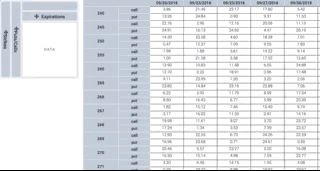

# FlatGrid

FlatGrid is a React component for displaying multi-dimensional data in a flat 2-dimensional grid

Demo site: http://belvedere-trading.github.io/flatgrid/index.html

Features:
- Ability to rearrange axes.
- Windowed rendering (only render the cells that are visible)
- Written in TypeScript

Compatibility warning:
- Uses CSS Grid and position sticky.

